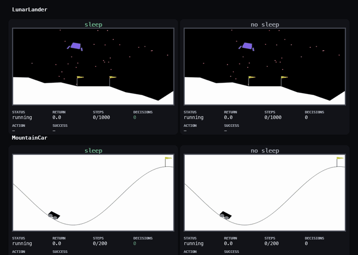

# Macro Action RL
Training a simple model to sleep in Gymnasium environments. This is to teach the model to plan into the future.

## Environments
We have the lunar landing and mountain car environments. In lunar landing, the sleep model almost always wins out over the non sleep model but in mountain car, they tend to reach the same outcome almost everytime. 

I added both to show that sleep as a label is only useful in some scenarios and learning to use it in highly precise ways is hard.

## Reward changes

LunarLander gets a small terminal penalty for landing too fast, so it cannot exploit rough landings. MountainCar gets light shaping for pushing with its velocity, moving right, and reaching the goal, so learning is less sparse without directly helping sleep.

## Do it yourself
For training both models on both envs:
`uv run main.py train`

Models will be stored in `models_multi/` and the training graphs will be stored in `training_graphs_multi`

For running interactive inference:
`uv run main.py test`

Optional configs to tune:
uv run main.py train --run-name exp1 --timesteps 100000
uv run main.py test --run-name exp1 --episodes 5
